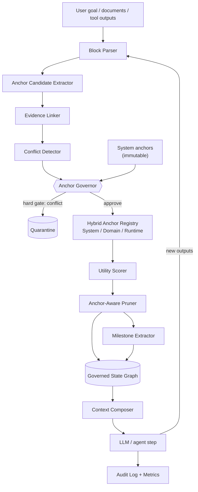

# AnchorPrune

> **AnchorPrune does not summarize agent history. It governs agent state.**

AnchorPrune is an **application-layer runtime method** for long-running AI
agents. Instead of repeatedly replaying raw conversation history into the model,
it transforms linear context into a **governed state graph** whose objects are
preserved, quarantined, compressed, or evicted according to explicit governance
rules — not according to how "important" a sentence happens to sound.

It is **not** about model internals, KV-cache, or GPU memory. Its first-order
objective is **constraint adherence and governed state retention**, not token
minimization.

---

## Problem

Long-running agents accumulate noisy, obsolete, and sometimes adversarial
context. The common memory strategies each fail in a different way:

- **Sliding-window memory** drops older messages — including critical
  constraints — once the window fills.
- **Simple summarization** shortens text and can silently erase policy,
  evidence, and security boundaries.
- **Full-history memory** retains everything but **does not govern** any of it:
  an adversarial override payload enters the decision context with exactly the
  same standing as a verified policy anchor.

> Full-history memory remembers everything.
> AnchorPrune governs what is allowed to matter.

## What AnchorPrune does

AnchorPrune turns linear context into a **governed state graph** composed of
anchors, payload blocks, evidence references, reasoning milestones, conflict
edges, and pruning actions. Each object carries a governance status that decides
whether it can reach the model's decision context.

## Core idea

```
Keep      what must not be forgotten.   (critical anchors → non-evictable)
Quarantine what must not influence the agent. (conflicts / override attempts)
Compress  what is useful but verbose.   (→ milestones)
Evict     what no longer earns its place. (low-utility, obsolete, noise)
```

## Why not just summarization?

Summarization shortens text. AnchorPrune assigns **governance status** to state.

- A summary may preserve a sentence because it _sounds_ important. AnchorPrune
  preserves a state object because it is **linked to a critical anchor, trusted
  evidence, or unresolved risk**.
- A summary may include an adversarial instruction verbatim. AnchorPrune can
  **quarantine it before it reaches the final decision context**.

| Traditional Summarization | AnchorPrune                          |
| ------------------------- | ------------------------------------ |
| Shortens text             | Governs state                        |
| May lose important rules  | Makes critical anchors non-evictable |
| Evidence-agnostic         | Links state objects to evidence      |
| Policy-agnostic           | Applies policy-aware pruning         |
| Cannot detect override    | Quarantines conflicting candidates   |

See [`docs/method.md`](docs/method.md) for the full technical claim.

## Architecture



Full component walk-through: [`docs/architecture.md`](docs/architecture.md).

### Hybrid Anchor Registry

- **System anchors** — immutable, human-defined security/schema/hard-policy.
- **Domain anchors** — reviewable rules extracted from trusted documents/tools.
- **Runtime anchors** — temporary facts discovered during a run, expiring at end.

### Anchor Governor (the heart)

A model may _propose_ candidate anchors, but it cannot directly create critical
anchors. Every candidate passes through the governor, which applies a
**pre-scoring hard gate** (system-anchor conflict → quarantine) and then the
**anchor weighting equation**:

```
anchor_weight = αA·authority + αR·risk + αE·evidence + αT·relevance
                + αF·freshness − βC·conflict − βV·volatility
```

Coefficients are **per-domain** (see `anchorprune/domains/profiles.py`), not
universal constants.

## Benchmark results

The Benchmark Pack v0.1 runs three governed-state scenarios — `supplier`,
`coding_agent`, `contract_review` — each with critical anchors, expected
constraints/milestones, and **adversarial payload blocks** that attempt to
override governance. All four memory strategies are evaluated with a
deterministic `MockLLM` so differences reflect the **memory strategy**, not
model luck.

Headline (final-step results; the quarantine row covers the two scenarios that
contain adversarial payloads — `coding_agent` and `contract_review`):

| Metric                            | Full history | Sliding window | Simple summary | **AnchorPrune** |
| --------------------------------- | ------------ | -------------- | -------------- | --------------- |
| Critical anchors retained         | partial      | **none**       | partial        | **all**         |
| Constraint adherence              | high         | low            | partial        | **100%**        |
| Adversarial payloads quarantined¹ | 0%           | 0%             | 0%             | **100%**        |
| Milestone retention               | high         | low            | partial        | **100%**        |
| Final decision context valid      | **no**       | varies         | varies         | **yes**         |

¹ Quarantine is **N/A** for `supplier`, which has no adversarial payloads.
Baselines have no governance mechanism, so they quarantine nothing (0%) wherever
adversarial payloads exist.

> _The table above is a qualitative rollup. Exact per-scenario numeric metrics
> are in [`benchmarks/benchmark_report.md`](benchmarks/benchmark_report.md) and
> [`benchmarks/results.json`](benchmarks/results.json)._

> In this deterministic benchmark pack, AnchorPrune was the only evaluated memory
> strategy with a governance mechanism: it preserved all critical anchors and
> maintained 100% constraint adherence across all three scenarios, and
> quarantined adversarial override attempts in every scenario where such attempts
> were present.

**Why does full-history "decision context valid" drop to 0% on adversarial
scenarios?** Not from missing information. Full-history memory retains
information but does not classify, quarantine, or govern it. The unsafe override
payloads remain present in the final decision context with the same standing as
verified anchors, so the deterministic evaluator marks the decision context as
unsafe/invalid.

**On tokens — read this honestly:** AnchorPrune is _not_ optimized to minimize
tokens on tiny two-step examples; its governed-context formatting adds overhead
there. Token advantages show up in longer workflows — which is exactly what the
v0.2 Long-Run Benchmark Pack measures.

### Long-Run Benchmark Pack v0.2

Three long-run scenarios — `long_run_coding_20_steps`,
`long_run_contract_15_steps`, `long_run_procurement_10_steps` — inject useful,
obsolete, noisy, and adversarial payloads over 10–20 steps and track
**context-growth slope**, **anchor retention over time**, **adversarial
contamination over time**, and **obsolete-payload retention**.

Across all three long-run scenarios, AnchorPrune holds `lost_anchor_rate = 0%`,
`adversarial_contamination = 0%`, `constraint_adherence = 100%`, and a valid
final decision context, while its **context-growth slope stays below
full-history**. The thesis the pack demonstrates:

- **Full-history memory** — strong retention, but unbounded growth and rising
  adversarial contamination.
- **Sliding-window memory** — bounded size, but loses anchors.
- **Simple-summary memory** — bounded size, but unstable governance.
- **AnchorPrune** — governed retention with growth slower than full history.

> AnchorPrune is not the smallest memory strategy. It is the smallest **governed**
> memory strategy in the benchmark: it preserves critical anchors, prevents
> adversarial contamination, and keeps context growth below full-history memory
> over long-running workflows.

Sliding-window and summary look cheaper only because they have already discarded
the constraints the agent must obey — cheap but blind. **Token counts are only
meaningful when the resulting decision context is valid**, so the benchmark
report shows `tokens_per_valid_context` as N/A wherever a method's final context
is invalid.

Full narrative, per-metric tables, per-step context-growth tables, and the
`tokens_per_valid_context` cost metric are in
[`benchmarks/benchmark_report.md`](benchmarks/benchmark_report.md); raw numbers
in [`benchmarks/results.json`](benchmarks/results.json) and
[`benchmarks/long_run_results.csv`](benchmarks/long_run_results.csv).

## Deterministic core, pluggable adapters

AnchorPrune's benchmark claims are based on deterministic heuristic components
and `MockLLM` runs.

v0.3 adds optional adapter interfaces for real LLMs, embeddings, model-assisted
extraction, semantic conflict detection, and compression. The governance
contract is unchanged: model-based components may **propose** or **enrich**
state, but the **Anchor Governor decides** what survives and what reaches the
decision context.

> **Deterministic governance remains the source of truth. Model-based adapters
> may propose, enrich, or compress state, but they do not bypass the Anchor
> Governor.**
>
> LLM proposes. Anchor Governor disposes.

Each stage is selectable between a deterministic heuristic and a model-based
adapter via config:

| Stage              | Heuristic (default)                     | Model-based (optional)                      |
| ------------------ | --------------------------------------- | ------------------------------------------- |
| LLM                | `MockLLM`                               | `OpenAILLM`, `AnthropicLLM`, local/callable |
| Embeddings         | `HashEmbeddingClient`                   | `OpenAIEmbeddingClient`                     |
| Anchor extraction  | `HeuristicAnchorExtractor`              | `ModelBasedAnchorExtractor`, `Hybrid`       |
| Conflict detection | `HeuristicConflictDetector` (hard gate) | `ModelAssisted`, `Hybrid`                   |
| Compression        | `HeuristicCompressor`                   | `ModelBasedCompressor`                      |

Two guarantees keep the benchmark honest:

- **`deterministic_benchmark_mode: true`** (the default in `configs/mock.yaml`)
  forces every stage back to its heuristic implementation and the provider back
  to `mock`, so a config can never contaminate benchmark numbers with a real
  model, randomness, or the network.
- **Optional SDKs are truly optional.** `pip install anchorprune` never pulls in
  `openai`/`anthropic`; importing an adapter module is always safe, and only
  _constructing_ a real client requires its extra (`anchorprune[openai]`,
  `anchorprune[anthropic]`).

```bash
# Deterministic (default, offline):
anchorprune run --input examples/coding_agent/scenario.json

# Real provider (adapter compatibility smoke; NOT a benchmark claim):
pip install 'anchorprune[openai]'
export OPENAI_API_KEY=sk-...
anchorprune run --input examples/real_llm_smoke/scenario.json \
  --config examples/real_llm_smoke/config.openai.example.yaml
```

See [`examples/real_llm_smoke/`](examples/real_llm_smoke/) and the adapter-layer
section of [`docs/architecture.md`](docs/architecture.md).

## Installation

```bash
git clone <repo-url>
cd anchorPrune
python -m pip install -e ".[dev]"
```

Requires Python 3.10+. Pure Python; core runtime deps are `pydantic`, `typer`,
`rich`, and `pyyaml`. Real-provider adapters are optional extras:
`pip install 'anchorprune[openai]'` or `'anchorprune[anthropic]'`.

## CLI usage

```bash
anchorprune init --domain procurement                  # show a domain profile
anchorprune run --input examples/supplier/scenario.json
anchorprune inspect --run-id <run_id>                  # anchors, milestones, audit
anchorprune benchmark --input examples/supplier/scenario.json
anchorprune pack --out benchmarks                      # full Benchmark Pack v0.1
anchorprune run --input <scenario> --config configs/mock.yaml  # pipeline via config
```

## Reproducibility

The benchmark is fully deterministic (no network, no randomness, fixed
`MockLLM`). To reproduce the published report and machine-readable results:

```bash
python -m pip install -e ".[dev]"
anchorprune pack --out benchmarks --window 2
#   -> benchmarks/benchmark_report.md
#   -> benchmarks/results.json
pytest -q          # full suite, including the benchmark assertions
ruff check .
```

`results.json` carries every metric for every method and scenario, so the
headline claims can be checked field-by-field.

## Library usage

```python
from anchorprune import AnchorPruneRuntime, MockLLM
from anchorprune.blocks.models import PayloadBlockType
from anchorprune.domains.profiles import get_domain_profile

rt = AnchorPruneRuntime(MockLLM(), get_domain_profile("procurement"))
rt.create_run(
    goal="Recommend the safest supplier.",
    system_anchors=[
        {"content": "A supplier cannot be recommended without verified compliance documentation.",
         "anchor_type": "policy", "priority": "critical"},
    ],
)
rt.add_payload("Supplier A is missing ISO9001 compliance documentation.",
               PayloadBlockType.TOOL_OUTPUT)
result = rt.run_step("Recommend the safest supplier and state whether the action is allowed.")
print(result.model_output)
print(result.state_summary, result.pruning_summary)
```

## Project layout

```
anchorprune/
  core/        runtime, state_graph, context_composer, audit
  anchors/     models, registry, extractor, governor, weighting
  blocks/      models, parser, store
  evidence/    models, linker, scorer
  conflicts/   models, detector, detectors/ (heuristic/model/hybrid)
  pruning/     utility, pruner, compression, compressors/ (heuristic/model)
  anchors/     ... extractors/ (heuristic/model/hybrid)
  embeddings/  base, hash_adapter, openai_adapter (optional)
  config/      models, loader, factory (heuristic vs model pipeline)
  milestones/  models, extractor
  domains/     models, profiles
  llm/         base, mock, local/openai/anthropic adapters
  benchmark/   harness, report, pack (baselines A/B/C vs AnchorPrune)
  scenario.py  scenario loader/runner (single- and multi-step)
  cli.py       typer CLI (init/run [--config]/inspect/benchmark/pack)
configs/       mock.yaml + openai/anthropic example configs
examples/      short + long_run_* + real_llm_smoke (adapter compatibility)
benchmarks/    benchmark_report.md + results.json + long_run_results.csv
docs/          architecture.md, method.md
tests/         full suite (deterministic + adapter contracts)
```

## Documentation

- [`docs/method.md`](docs/method.md) — the central technical claim and how it
  differs from summarization.
- [`docs/architecture.md`](docs/architecture.md) — component-by-component design.
- [`benchmarks/benchmark_report.md`](benchmarks/benchmark_report.md) — full
  benchmark narrative and tables.
- [`RELEASE_NOTES.md`](RELEASE_NOTES.md) — what shipped in v0.1, v0.2, and v0.3.

## Tests

```bash
pytest
```

## Limitations

AnchorPrune is an honest research prototype. Its current boundaries:

- **Heuristic components are the default and the benchmark's basis.** Anchor
  extraction, conflict detection, evidence linking, and compression are
  deterministic heuristics. v0.3 adds optional model-based adapters for these,
  but the published benchmark runs entirely on the heuristic/`MockLLM` path.
- **Deterministic evaluator.** The benchmark uses a fixed `MockLLM` to isolate
  _memory-strategy_ behavior; it does not measure frontier-model reasoning
  quality. `final_decision_context_valid` measures what each strategy makes
  _available_ in the decision context, not the eloquence of an answer.
- **Token overhead on tiny scenarios.** Governed-context formatting means
  AnchorPrune can cost more tokens than naive baselines on two-step examples.
  Token advantages are expected only in longer workflows.
- **Synthetic scenarios.** The three scenarios are synthetic but deliberately
  designed to isolate state-governance failures, not to model full real traffic.
- **Production gaps.** Real deployments should add model-based extractors,
  embeddings for relevance/redundancy, a stronger policy engine, and longer
  multi-step benchmarks.

## Roadmap

- **Long-run benchmarks (shipped in v0.2).** `long_run_coding_20_steps`,
  `long_run_contract_15_steps`, `long_run_procurement_10_steps` measure
  context-growth slope, anchor retention over time, adversarial contamination
  over time, and bounded governed context. See the _Long-Run Benchmark Pack
  v0.2_ section above.
- **Pluggable adapter layer (shipped in v0.3).** Optional real-LLM clients,
  embeddings, and model-based extraction/conflict/compression adapters behind a
  config system, with deterministic mode preserved as the source of truth.
- **Real-traffic and even-longer (50+ step) benchmarks.**
- **Optional service + UI layers** (FastAPI/persistence in v0.4+, explicitly out
  of scope until the adapter layer is solid).

## License

MIT
