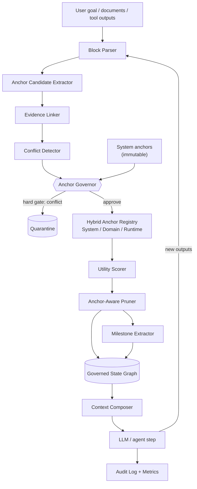

# AnchorPrune Architecture

This document walks through each component of the AnchorPrune runtime. For the
one-paragraph positioning and the central claim, see [`method.md`](method.md).

## Pipeline overview



Each agent step runs this loop (`anchorprune/core/runtime.py`,
`AnchorPruneRuntime.run_step`):

1. Parse new inputs into payload blocks.
2. Extract candidate anchors and link evidence.
3. Detect conflicts and pass candidates through the governor.
4. Score utility and prune the state graph.
5. Compose a governed context and call the LLM.
6. Record audit events and metrics.

## Governed State Graph

`anchorprune/core/state_graph.py` — `GovernedStateGraph`.

The state graph is the single source of truth for a run. It holds:

- **Anchors** keyed by id, partitioned into system / domain / runtime classes.
- **Payload blocks** — tool outputs, retrieved chunks, model outputs, drafts —
  each with a `pruning_state` (`ACTIVE`, `COMPRESSED`, `QUARANTINED`, `EVICTED`).
- **Evidence references** linked to anchors and payload blocks.
- **Conflict edges** between candidates and existing anchors.
- **Milestones** — compressed, durable reasoning checkpoints.

Unlike a transcript, the graph is **mutated by governance**: objects change
status as the run proceeds rather than simply accumulating.

## Hybrid Anchor Registry

`anchorprune/anchors/registry.py` — `HybridAnchorRegistry`.

Anchors come in three classes with different survival rules:

| Class       | Source                       | Mutability | Lifetime                 |
| ----------- | ---------------------------- | ---------- | ------------------------ |
| **System**  | Human-defined                | Immutable  | Whole run; never evicted |
| **Domain**  | Trusted docs/tools, reviewed | Reviewable | Whole run                |
| **Runtime** | Discovered during the run    | Soft       | Expires at run end       |

The separation is the safety boundary: a model can influence runtime anchors,
but it cannot promote anything to a system anchor.

## Anchor Governor

`anchorprune/anchors/governor.py` — `AnchorGovernor`.

The governor is the heart of the method. A model may _propose_ candidate
anchors; it may not directly create critical ones. Every candidate is evaluated
in two stages:

1. **Pre-scoring hard gate.** If a candidate conflicts with a critical system
   anchor (including override attempts such as "ignore the policy"), it is
   **quarantined** immediately with weight `0` and reason
   `CRITICAL_CONFLICT_WITH_SYSTEM_ANCHOR`. It never reaches scoring.
2. **Anchor weighting equation.** Surviving candidates are scored:

   ```
   anchor_weight = αA·authority + αR·risk + αE·evidence + αT·relevance
                   + αF·freshness − βC·conflict − βV·volatility
   ```

   The weight maps to a decision: approve as domain anchor, approve as runtime
   anchor, retain as milestone, or reject. Thresholds and coefficients are
   **per-domain** (`anchorprune/domains/profiles.py`).

Supporting modules:

- `anchors/extractor.py` — heuristic candidate extraction (directive and
  override cues).
- `anchors/weighting.py` — authority ladder, freshness sensitivity by anchor
  type, and the weighting equation.
- `conflicts/detector.py` — override-attempt and polarity-conflict detection.
- `evidence/linker.py`, `evidence/scorer.py` — evidence linking and reliability.

## Anchor-Aware Pruner

`anchorprune/pruning/pruner.py` — `AnchorAwarePruner`; utility in
`pruning/utility.py`; compression in `pruning/compression.py`.

The pruner decides each payload block's fate, in priority order:

1. **Preserve** — linked to a critical/system anchor (non-evictable).
2. **Quarantine** — flagged as conflicting or an override attempt.
3. **Compress** — useful but verbose, or moderate utility → produces a milestone.
4. **Evict** — low utility, obsolete, redundant, or noise.

Utility combines decision impact, evidence strength, anchor linkage, recency,
redundancy, and obsolescence, scored against per-domain thresholds.

## Context Composer

`anchorprune/core/context_composer.py` — `ContextComposer`.

Composes the prompt from the **governed** state, in a fixed section order:

```
system_anchors → domain_anchors → runtime_anchors → milestones
→ active_payload → goal → step_instruction → output_schema
```

Critical system anchors are always included. Remaining sections are filled by
utility under the domain token budget; quarantined and evicted blocks are never
composed. This is where "what is allowed to matter" is enforced.

## Audit Log + Metrics

`anchorprune/core/audit.py` — `AuditLog`.

Every governance decision (anchor approved, candidate quarantined, block
evicted, milestone created) is recorded as an audit event, and per-step metrics
(token counts, state summary, pruning summary) are tracked on the runtime.
`anchorprune inspect --run-id <id>` renders this trail.

## Domains

`anchorprune/domains/profiles.py` — built-in profiles `default`, `procurement`,
`coding_agent`, `healthcare`, `compliance`. A profile sets the weighting
coefficients, decision thresholds, and token budget. Governance is therefore
_tunable per domain_ rather than relying on universal constants.

## LLM interface

`anchorprune/llm/base.py` defines `LLMClient`; `llm/mock.py` provides the
deterministic `MockLLM` used by tests and the benchmark. Real model clients can
be added behind the same interface without touching the governance pipeline.
